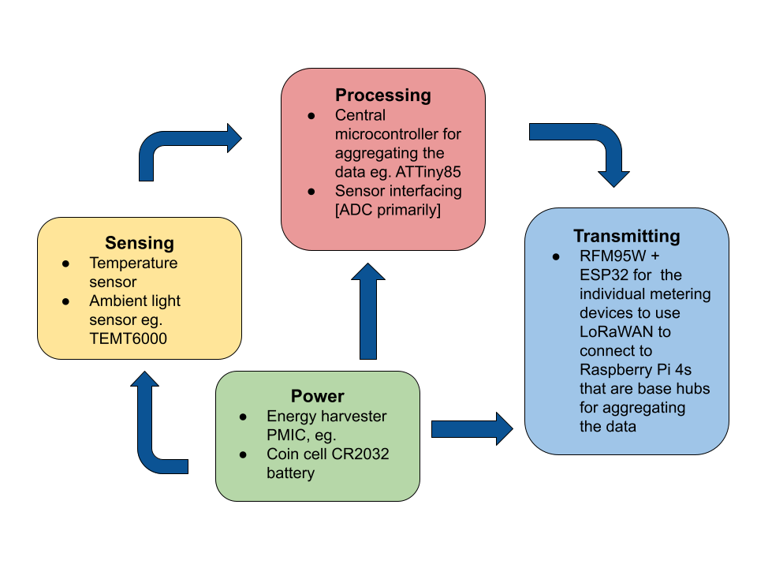

# Week of 2/24

* Project Proposal
* Rough Draft of Block Diagram
* Thermodynamic Calculation of Library's Heating Potential 
  * (in an ideal circumstance)
* Qualitative Heat Map of the Library

## Progress Report

### Block Diagram Rough Draft

</img>

### Thermodynamic Calculations

Refer to <a href="/docs/project-proposal/back-env-calc">Project -> Project Proposal -> Back of the Envelope Calculations</a>

### Qualitative Heat Map

Refer to <a href="/docs/intro">Project -> Qualitative Heat Map</a>

