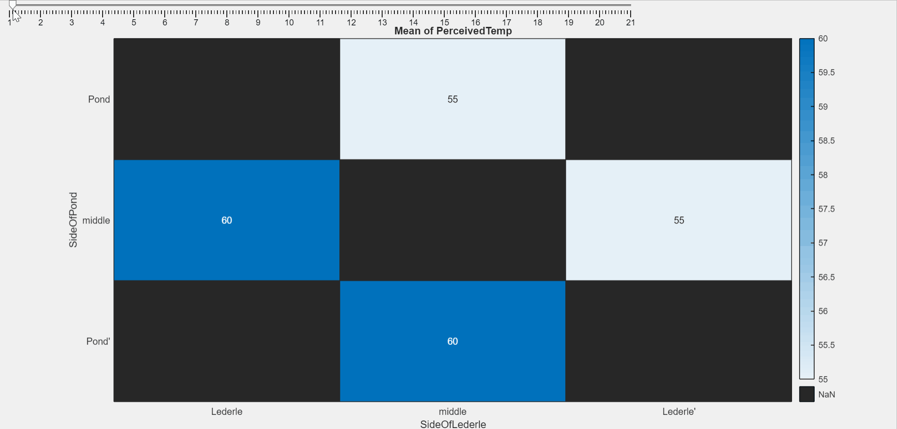

# Week of 2/24

* **Project Proposal** In accordance with the deliverables for iCons 389H, we have made a project proposal that details the deliverables for the roughly 10 weeks that we are doing the project for, along with a formal description of motivation, potential pitfalls, and literature review for the project.
* Rough Draft of Block Diagram
* Thermodynamic Calculation of Library's Heating Potential 
  * (in an ideal circumstance)
* **Qualitative Heat Map of the Library** A MATLAB app that visualizes the qualitative data we collected on the heating distribution of the W.E.B. DuBois library. This is a gif of it working, but you can interact with it at the link in the deliverables section.



## Deliverables

```
Add data about what we found, methodology, and links to where each thing is listed in the main Project Page
```
