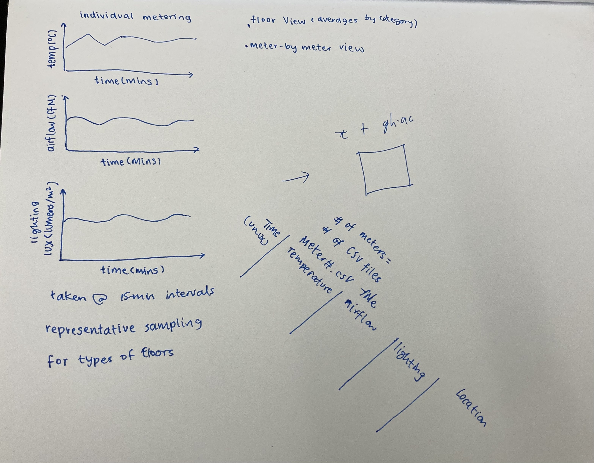

# Week of 03/03
* Progress Report
* Rough draft design of the infrastructure for the metering devices:

## Progress Report
We have created plans and started building a prototype for one of the metering devices. We reached out to Ted from Carbon Zero and Peter Volpe of Campus Metering and Controls at the Physical Plant and we are starting to make more specifications regarding the features and data flow of the meters.

### Infrastructure Design Rough Draft

</img>

